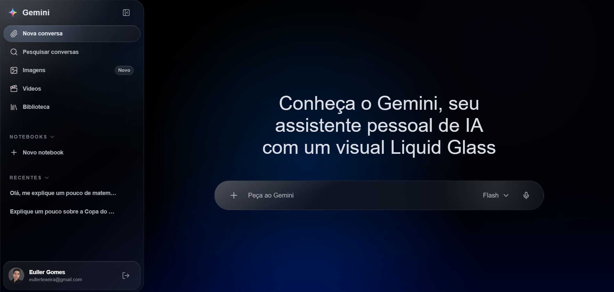
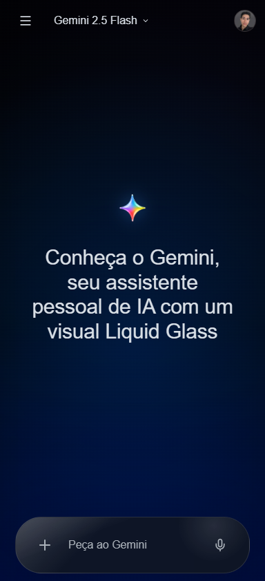
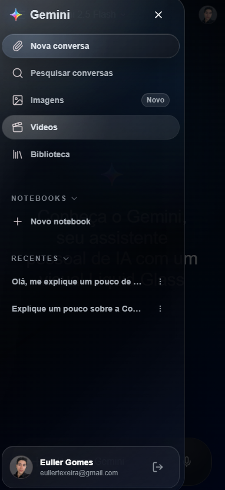

# Gemini Liquid Glass

Web app inspirado na experiencia do Gemini, com interface Liquid Glass, chat em streaming com Gemini API, login com Google via Auth.js e persistencia de conversas usando Prisma + Supabase Postgres.

O objetivo do projeto e entregar uma experiencia de chat polida, responsiva e funcional, mantendo a API key sempre no servidor e preparando a base para historico de conversas por usuario.

## Preview

### Desktop



### Mobile

<div style="display: flex; gap: 16px; align-items: flex-start; flex-wrap: wrap;">
	
	
</div>

## Stack

- Next.js 16 com App Router
- React 19
- TypeScript
- Tailwind CSS v4
- Vercel AI SDK
- Google Gemini API via `@ai-sdk/google`
- Auth.js / NextAuth
- Prisma
- Supabase Postgres
- React Markdown, Remark GFM e Rehype Sanitize
- Lucide React
- Zod

## Features

- Interface Gemini-like com acabamento Liquid Glass.
- Layout responsivo com sidebar persistente no desktop e drawer no mobile.
- Composer com autosize, envio por `Enter` e quebra de linha com `Shift+Enter`.
- Chat server-side com streaming quando a API permite.
- Tratamento visual para loading, erro, retry e ausencia de API key.
- Login com Google sem bloquear o uso anonimo do chat.
- Persistencia de conversas para usuarios autenticados.
- Rotas de conversa em `/<conversationId>`.
- Historico no sidebar com abertura e exclusao de conversas.
- Renderizacao segura de Markdown gerado pela IA.

## Instalacao

Instale as dependencias:

```bash
npm install
```

Crie o arquivo de ambiente local:

```bash
cp .env.example .env
```

No Windows PowerShell:

```powershell
Copy-Item .env.example .env
```

Preencha as variaveis no `.env`.

## Variaveis de Ambiente

```txt
GOOGLE_GENERATIVE_AI_API_KEY=
GOOGLE_GENERATIVE_AI_MODEL=gemini-3.1-flash-lite

AUTH_SECRET=
AUTH_URL=http://localhost:3000
AUTH_GOOGLE_ID=
AUTH_GOOGLE_SECRET=

DATABASE_URL=
DIRECT_URL=
```

### Gemini API

Crie uma chave no Google AI Studio e preencha:

```txt
GOOGLE_GENERATIVE_AI_API_KEY=
```

O modelo pode ser ajustado em:

```txt
GOOGLE_GENERATIVE_AI_MODEL=gemini-3.1-flash-lite
```

A chave e usada somente em rotas server-side.

### Google Login

Para habilitar o login, crie credenciais OAuth no Google Cloud Console e configure:

```txt
AUTH_GOOGLE_ID=
AUTH_GOOGLE_SECRET=
AUTH_SECRET=
AUTH_URL=http://localhost:3000
```

Em desenvolvimento, o callback OAuth deve apontar para:

```txt
http://localhost:3000/api/auth/callback/google
```

Voce pode gerar `AUTH_SECRET` com:

```bash
npx auth secret
```

Se o comando gerar outro nome de variavel, copie apenas o valor e coloque em `AUTH_SECRET`.

### Banco de Dados

O projeto usa Prisma com Supabase Postgres. Configure:

```txt
DATABASE_URL="postgresql://postgres.[PROJECT-REF]:[YOUR-PASSWORD]@[REGION].pooler.supabase.com:6543/postgres?pgbouncer=true"
DIRECT_URL="postgresql://postgres.[PROJECT-REF]:[YOUR-PASSWORD]@[REGION].pooler.supabase.com:5432/postgres"
```

Use `DATABASE_URL` para o runtime com pooler em transaction mode e `DIRECT_URL` para migrations.

Depois de preencher as URLs, rode:

```bash
npx prisma generate
npx prisma migrate dev
```

## Rodando Localmente

Inicie o servidor de desenvolvimento:

```bash
npm run dev
```

Abra:

```txt
http://localhost:3000
```

## Scripts

```bash
npm run dev
npm run lint
npm run build
npm run start
```

Antes de abrir um PR ou fazer deploy, rode:

```bash
npm run lint
npm run build
```

## Estrutura Principal

```txt
src/app/api/chat/route.ts                    Rota server-side do chat
src/app/api/conversations/route.ts           Lista conversas do usuario
src/app/api/conversations/[conversationId]   Historico/exclusao de conversa
src/app/[conversationId]/page.tsx            Pagina de conversa persistida
src/components/layout/app-shell.tsx          Shell principal do app
src/components/gemini/sidebar.tsx            Sidebar desktop/mobile
src/components/chat/chat-composer.tsx        Composer do chat
src/components/chat/chat-message.tsx         Mensagens e Markdown
src/auth.ts                                  Configuracao Auth.js
src/lib/prisma.ts                            Prisma Client
src/lib/conversations.ts                     Acesso a conversas persistidas
```

## Validacao Responsiva

Larguras recomendadas para teste manual:

```txt
360px, 375px, 430px, 768px, 959px, 960px, 1280px
```

Verifique se nao ha overflow horizontal, se o composer permanece visivel, se a sidebar/drawer nao cobre a conversa indevidamente e se o foco por teclado continua perceptivel.
